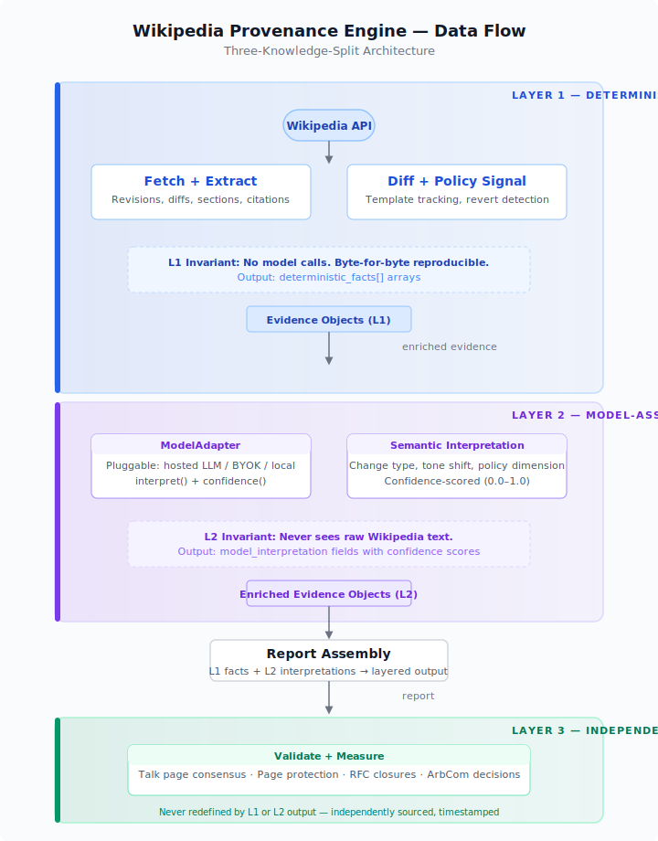

# Architecture: Three-Knowledge-Split Design

Varia separates computation into three architecturally isolated layers. No layer's output feeds into another layer's input in a way that would contaminate evidence with interpretation.

## Layer 1 (L1): Deterministic

**What it answers**: What changed, when, where, how — byte-for-byte reproducible.

**Implementation**: Wikipedia API fetch, diff computation, section extraction, citation counting, revert detection, template tracking, pagination. No model involved. Every run on the same revision range produces identical output.

**Output**: Evidence objects with `deterministic_facts` arrays.

**Why it matters on fandom wikis**: A Star Wars Legends page that had
`[[Category:Canon characters]]` removed and `[[Category:Legends characters]]`
added after the 2014 Disney acquisition. A claim that "Palpatine was killed in
Episode VI" softened to "Palpatine was seemingly killed" after Episode IX.
These are deterministic signals — no interpretation needed, the edit itself is
the event. L1 captures these as `category_removed`/`category_added` and
`claim_softened` events, byte-for-byte reproducible from the API response.

## Layer 2 (L2): Model-Assisted Interpretation

**What it answers**: What kind of change is this semantically? What policy dimension does it touch? With what confidence?

**Implementation**: Pluggable model adapter (default: hosted LLM, supports BYOK and local). Receives only deterministic evidence from L1. Never receives raw text — always pre-extracted facts with section, citation, and revert context.

**Output**: Evidence objects with `model_interpretation` fields, each carrying a `confidence` score (0.0–1.0).

**Why it matters on fandom wikis**: A revert chain on a "Luke Skywalker" page
could be simple vandalism reversion — or it could be a canon-era dispute where
one editor applies Disney-canon sources and another applies Legends-canon sources.
Both sides cite valid material from the same franchise. L1 reports the revert
pattern; L2 classifies it as a "sourcing dispute" vs. "vandalism reversion" —
with confidence — without ever seeing raw text. On a wiki with weaker sourcing
norms, L2 also classifies whether a revert signals "headcanon removal"
(unverifiable personal interpretation material) vs. "canon-correction"
(new official material overwriting outdated text).

## Layer 3 (L3): Independent Ground Truth

**What it answers**: Did real-world editorial processes validate the signal?

**Implementation**: Independently sourced ground truth — talk page consensus, page protection events, RFC closures, Arbitration Committee decisions. Never redefined by L1 or L2. Stored separately from pipeline output.

**Output**: Outcome labels with public observability timestamps and source references.

**Why it matters on fandom wikis**: Fan wiki talk pages are where canon disputes
get resolved — not by authority, but by editorial consensus with timestamps and
public permalinks. A 2015 talk page consensus that "Clone Wars TV series is
canon, novelizations are secondary" might be overturned in 2024 by a new consensus
citing a different set of source policies. L3 captures both outcomes independently,
with temporal validity windows. The pipeline doesn't decide canon — it reports
that the editorial community reached a specific consensus at a specific time.
On Wikipedia the ground truth is RFC closures and ArbCom decisions; on fandom
wikis it's talk-page-archived consensus with revision links to the exact edit
that implemented the decision.



## Data Flow (Text)

```
Wikipedia API
     │
     ▼
┌─────────────┐
│  L1: Fetch   │ ← Deterministic: revisions, diffs, sections, citations
│  + Extract   │
└──────┬──────┘
       │ evidence objects
       ▼
┌─────────────┐
│  L2: Model   │ ← Model-assisted: semantic change, policy labels, confidence
│  Interpret   │
└──────┬──────┘
       │ enriched evidence objects
       ▼
┌─────────────┐
│  Report      │ ← Assembles L1 facts + L2 interpretations into layered output
│  Assembly    │
└──────┬──────┘
       │ report
       ▼
┌─────────────┐
│  L3: Validate│ ← Independent: compares report against ground truth labels
│  + Measure   │
└─────────────┘
```

## Report Layers

Every user-facing output carries layer provenance:

| Label | Source | Reproducible? |
|-------|--------|---------------|
| **Observed** | L1 deterministic | Yes, byte-for-byte |
| **Policy-coded** | L1 + Wikipedia policy ontology | Yes, rules-based |
| **Model interpretation** | L2 LLM | No, bounded by confidence |
| **Speculative** | L2 low-confidence (<0.5) | No, flagged as uncertain |
| **Unknown** | Insufficient evidence | N/A |

## Model Adapter Contract

The L2 adapter must implement:

```typescript
interface ModelAdapter {
  interpret(evidence: EvidenceEvent[]): Promise<InterpretedEvent[]>;
  confidence(interpretation: ModelInterpretation): number;
}
```

Default adapter uses a hosted LLM. BYOK and local model endpoints are supported via the same interface.

## Invariants

1. L1 never calls a model
2. L2 never sees raw Wikipedia text (only pre-extracted deterministic facts)
3. L3 is never redefined by L1 or L2 output
4. No single accuracy score conflates layers
5. Every interpretation carries a confidence score
6. Deterministic facts are always presented before interpretations
