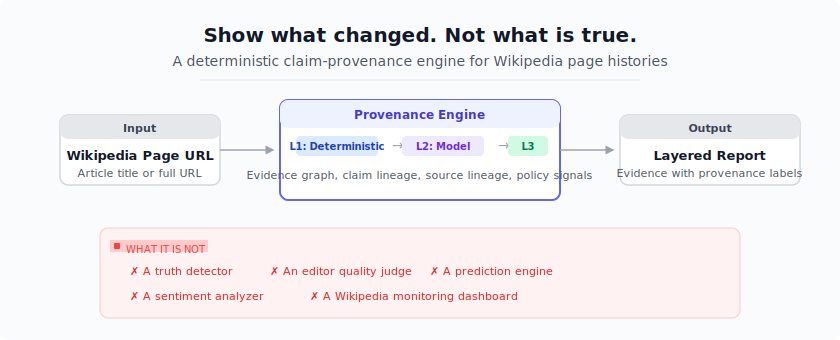
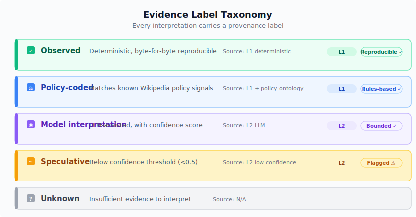

# Varia

[](https://github.com/nextconsensus/var-ia/actions/workflows/ci.yml)
[](https://github.com/nextconsensus/var-ia/releases)
[](./LICENSE)
[](https://www.npmjs.com/org/var-ia)

**Wikipedia page histories, reconstructed as evidence graphs.**

> Evidence, not truth.

A deterministic claim-provenance engine for Wikipedia page histories. This tool
reconstructs how claims moved through Wikipedia's editorial system — when they
appeared, how they changed, what sources supported them, and what policy signals
surrounded each change.

Built and open-sourced by [NextConsensus](https://nextconsensus.com).



## Why It Exists

Wikipedia is 15+ years of contested claims being rewritten, sourced, challenged,
and stabilized. Consider the Bitcoin page: in 2009 it called Bitcoin "a
peer-to-peer network." By 2017 it called it "a cryptocurrency." The page moved
twice, accumulated 100+ citations, added sections, and survived template disputes.

Varia surfaces that evolution as a structured event stream — not a diff soup to
reverse-engineer, but a queryable record of every claim, source, section, and
policy signal across every revision.

## What It Does

Given a Wikipedia page URL, the engine produces:

- **Claim lineage** — when a sentence first appeared, was reworded, strengthened,
  softened, or removed
- **Source lineage** — citations added, replaced, or removed
- **Timeline** — every revision, what changed, in which section
- **Policy signals** — verifiability, neutrality, BLP templates and edit patterns
- **Section history** — sections added, removed, reorganized
- **Edit classification** — revert, vandalism, sourcing, major addition/removal
- **Category and wikilink evolution** — categories/wikilinks added and removed
- **Model interpretation** — bounded, confidence-labeled: direct accusation →
  attributed finding, lead prominence → body placement

Every interpretation carries a layer tag:



| Label | Meaning |
|-------|---------|
| **Observed** | Deterministic, byte-for-byte reproducible |
| **Policy-coded** | Matches known Wikipedia policy signals |
| **Model interpretation** | LLM-assisted, with confidence score |
| **Speculative** | Below confidence threshold |
| **Unknown** | Insufficient evidence |

## Who This Is For

- **Investigative journalists** — trace how a claim about a public figure evolved
  across revision history: when it was added, who softened it, when sources
  appeared or disappeared
- **Wikipedia editors** — audit how policy templates (NPOV, BLP, due-weight)
  correlate with content changes over time
- **Data scientists & researchers** — deterministic features for edit-quality
  models, sourcing-behavior studies, content-drift measurement
- **OSINT analysts** — structured event streams from public editorial history,
  reproducible on request
- **Fan wiki communities** — canon disputes, headcanon drift, content-fork
  detection across MediaWiki instances

## Quick Start

```bash
# One Docker command, no install needed:
docker run --rm $(docker build -q .) analyze "Bitcoin" --depth quick

# Or with bun:
bun add @var-ia/cli
wikihistory analyze "Bitcoin" --depth quick
```

What you'll see:

```
Analysis of "Bitcoin" at depth quick found 330 events across 20 revisions.

[2009-03-08T16:41:44Z] wikilink_added (rev 275832581→275832690)
  Section: body
  • target: cryptography

[2009-08-05T23:50:52Z] wikilink_added (rev 275850009→306304462)
  Section: body
  • target: proof-of-work
  • target: hashcash

[2009-08-05T23:50:52Z] section_reorganized (rev 275850009→306304462)
  Section: Proof-of-work
  • change: added

[2009-12-10T14:15:09Z] citation_added (rev 308164432→308164529)
  Section: (lead)
  • ref: sourceforge.net/projects/bitcoin/

[2009-12-12T00:18:49Z] template_added (rev 308164529→308180771)
  Section: body
  • template: primarysources
```

The full output (330 events) is in
[docs/example-output.md](./docs/example-output.md).

### Use individual packages

```bash
bun add @var-ia/evidence-graph @var-ia/analyzers
```

```ts
import type { EvidenceEvent, Revision } from "@var-ia/evidence-graph";
import { sectionDiffer, citationTracker } from "@var-ia/analyzers";
```

## Packages

| Package | npm | Description |
|---------|-----|-------------|
| `@var-ia/evidence-graph` | [](https://www.npmjs.com/package/@var-ia/evidence-graph) | Core types and schemas — claim, evidence, source, report |
| `@var-ia/ingestion` | [](https://www.npmjs.com/package/@var-ia/ingestion) | Wikimedia API adapters — fetching, diffing, rate limits |
| `@var-ia/analyzers` | [](https://www.npmjs.com/package/@var-ia/analyzers) | Deterministic analyzers — sections, citations, reverts, templates |
| `@var-ia/interpreter` | [](https://www.npmjs.com/package/@var-ia/interpreter) | Pluggable model adapter for semantic interpretation |
| `@var-ia/persistence` | [](https://www.npmjs.com/package/@var-ia/persistence) | SQLite persistence (Bun-only) |
| `@var-ia/cli` | [](https://www.npmjs.com/package/@var-ia/cli) | CLI tool — `wikihistory` command |
| `@var-ia/eval` | [](https://www.npmjs.com/package/@var-ia/eval) | Evaluation harness with benchmark pages |

## How It Compares

Varia tracks **claim provenance** — structured evidence linking a claim's lifecycle
to specific revisions, sources, and policy signals. It complements existing tools:

| Tool | What it does | What varia adds |
|------|-------------|-----------------|
| **WikiWho** | Sentence-level authorship (who wrote which token) | Claim lifecycle: when a sentence first appeared, was reworded, strengthened, softened, or removed |
| **ORES** | ML edit quality scores (likely damaging, good-faith) | Deterministic edit classification + policy-coded signals with confidence-labeled L2 interpretation |
| **XTools** | Edit stats, page history summaries, top editors | Structured event stream: section changes, citation turnover, template diffs, page moves, category shifts |
| **PetScan** | Category intersection queries across pages | Category evolution per-page over time |

## Architecture

The engine follows a three-knowledge-split:

1. **Deterministic** (L1): Wikipedia API ingestion, diff computation, section
   extraction, citation tracking, template classification, revert detection —
   byte-reproducible, no model involved.
2. **Model-assisted** (L2): Semantic change classification, policy-dimension
   tagging, claim state inference — bounded with confidence scores.
3. **Outcome labels** (L3): Independently sourced ground truth (talk page
   consensus, page protection events) — never redefined by the pipeline.

**Invariants:** L1 never calls a model | L2 never sees raw text | L3 never
redefined by L1/L2 | Every interpretation carries a confidence score |
Deterministic facts before interpretations.

[Full architecture](./ARCHITECTURE.md)

## Beyond Wikipedia

Varia works on any public MediaWiki instance — Fandom.com, independent fan wikis,
private wikis. Wikipedia's editorial norms suppress the most interesting dynamics;
fandom wikis don't.

| Dynamic | What Varia captures |
|---------|-------------------|
| **Canon disputes** | `category_removed`: `Canon characters` → `category_added`: `Legends characters` after the 2014 Disney acquisition |
| **Headcanon drift** | "Vader turned because of fear of loss" vs "pride and ambition" — reversibly edited, both cite the same films |
| **Warring wikis** | Cross-wiki diff detects a Game of Thrones Fandom wiki fork vs parallel evolution on an independent ASOIAF wiki |
| **Decade-spanning consensus** | 2008 talk page consensus about what's canon, overturned in 2023 — L3 outcome labels with temporal validity windows |

If the engine handles fandom, it handles anything.

## What It Is Not

| Category | Reason |
|----------|--------|
| Truth detector | Does not judge accuracy of content |
| Editor quality judge | Does not score or rank editors |
| Prediction engine | Does not forecast outcomes |
| Sentiment analyzer | Does not score tone or toxicity |
| Live monitor | Does not track changes in real-time |
| Healthcare scorer | Domain-agnostic by design |

## License

AGPL-3.0. See [LICENSE](./LICENSE).

If you modify this software and deploy it as a network service, you must release
your modifications.

**Commercial use:** NextConsensus offers commercial licenses for proprietary
integration without AGPL obligations. See [nextconsensus.com](https://nextconsensus.com).

## Community

- [Contributing](./CONTRIBUTING.md) — how to get started
- [Good first tasks](./ROADMAP.md) — ready-to-pick-up work items
- [Discussions](https://github.com/nextconsensus/var-ia/discussions) — questions, ideas
- [Code of Conduct](./.github/CODE_OF_CONDUCT.md)
- [Security](./.github/SECURITY.md)
- [Changelog](./CHANGELOG.md)
- [Cite this software](./CITATION.cff)
